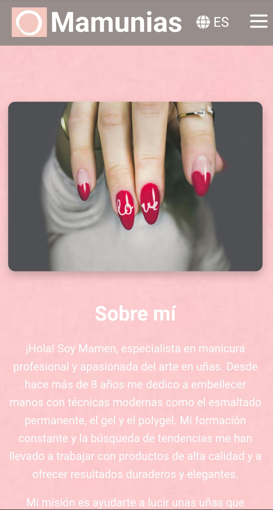

# Mamunias  

Este proyecto es una página web moderna y responsive que combina funcionalidad y diseño intuitivo. Incluye un **menú hamburguesa** muy práctico para dispositivos móviles, un **carrusel de productos** interactivo que resalta lo mejor de tu catálogo, y un **formulario de contacto** con validación para asegurar que los mensajes lleguen correctamente.

Además, gracias a su sistema de traducción dinámica, puedes cambiar fácilmente entre **español** e **inglés**, adaptándose a una audiencia más amplia.

## Características principales 🚀

- **Menú Hamburguesa**: Menú responsive que se adapta a pantallas móviles.
- **Carrusel de Productos**: Carrusel con Swiper.js para mostrar productos de forma visual y fluida.
- **Formulario de Contacto**: Validación de campos (nombre, email y mensaje) antes de enviar el formulario.
- **Soporte Multilingüe**: Cambia entre español e inglés con un solo clic, gracias a su sistema de traducción basado en JSON dinámico.

## Vista Previa 👀

## Construido con 🛠️

Este proyecto ha sido desarrollado utilizando las siguientes tecnologías:

- **HTML5**: Estructura de la página web.

- **CSS3**: Estilos para la página y el carrusel de productos.

- **JavaScript**: Lógica de la página web, incluyendo el menú hamburguesa, el carrusel con Swiper.js y la validación de formularios.

- **Swiper.js**: Librería para la creación de carruseles y deslizadores de contenido.

- **Fetch API**: Para cargar y gestionar las traducciones desde archivos JSON.

- **SweetAlert2**: Librería para mostrar alertas de manera interactiva al usuario.

## Funcionalidad 🧩

1. **Menú Hamburguesa**\

    -   El menú de navegación se convierte en un ícono en pantallas más pequeñas. Al hacer clic en el ícono, el menú se despliega para ofrecer las    opciones de navegación.

2. **Carrusel de Productos**\

    -   El carrusel utiliza Swiper.js para mostrar productos en una secuencia infinita. El número de productos visibles cambia dependiendo del tamaño de la pantalla:

        - Móviles: 1 producto visible.

        - Tablets: 2 productos visibles.

        - Pantallas grandes: 4 productos visibles.

    El carrusel tiene un autodeslizado cada 3 segundos.

3. **Formulario de Contacto**\

    -   El formulario incluye tres campos: nombre, email y mensaje. Los campos se validan con las siguientes reglas:

            El nombre debe contener solo letras y espacios.

            El email debe tener un formato válido.

            El mensaje debe tener al menos 10 caracteres.

    Si la validación es exitosa, se muestra un cuadro de confirmación antes de enviar el formulario.

4. **Soporte Multilingüe**\

    -   La página puede cambiar entre español e inglés. Se pueden agregar más idiomas creando nuevos archivos de traducción en la carpeta locales/. Para cambiar el idioma, el usuario solo necesita hacer clic en un botón de cambio de idioma.

## Realizando las pruebas ⚙️

Se llevaron a cabo pruebas manuales en diferentes navegadores y dispositivos para garantizar:

- Funcionamiento correcto del menú hamburguesa.
- Visualización fluida del carrusel en distintos tamaños de pantalla.
- Validación de formularios con feedback adecuado al usuario.
- Cambio dinámico de idioma sin errores.

## Deploy 🌐

Este proyecto está desplegado en Netlify:

🔗 [Ver sitio en producción](https://mamunias.netlify.app)

## Versionado 📌
Este proyecto se ha utilizando **Git** y **GitHub** para el control de versiones, lo que permite mantener un registro detallado de los cambios realizados durante el desarrollo. 

## Licencia 📄
Este proyecto está bajo la [MIT License](./LICENSE).

## Expresiones de Gratitud 🎁

📢Podéis invitarme a una cerveza 🍺 o un café ☕.\
Gracias por la Lectura 🤓.
